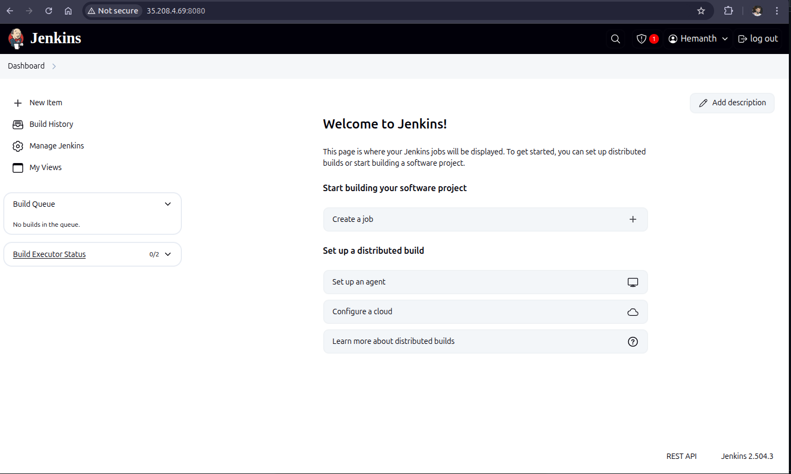

# Install Jenkins On server

In this Repository we will discuss how to install jenkins on ubuntu server.

- There are **2 Ways** to install jenkins on server.
  - Install Jenkins directly on Os ( Requires manual effect)
   Run Jenkins on Docker container.

## Common steps

1. Create a server
2. Configure Firewall Setting for the server.
    - 22 --> SSH
    - 8080 --> jenkins (open port for incoming requests)
3. Connect it via ssh from your machine
   - ```bash ssh <instance_name>@<ip_address> ```   


## Install jenkins directly on Os

1. Update your server
    - ```bash
       sudo apt update
       sudo apt upgrade
       ```
2. Install java (openjdk 17)
    - ```bash
      sudo apt install openjdk-17-jdk -y
      java --version
      ```
3. Add the Jenkins Repository key and source list
  - ```bash
    # Add the Jenkins GPG key
    sudo wget -O /usr/share/keyrings/jenkins-keyring.asc \
      https://pkg.jenkins.io/debian-stable/jenkins.io-2023.key
    
    # Add the Jenkins repository to your sources.list.d
    echo "deb [signed-by=/usr/share/keyrings/jenkins-keyring.asc]" \
      https://pkg.jenkins.io/debian-stable binary/ | sudo tee \
      /etc/apt/sources.list.d/jenkins.list > /dev/null
    ```
    - > sudo wget -O /usr/share/keyrings/jenkins-keyring.asc ... : Downloads the Jenkins GPG public key and saves it to a specific directory where apt looks for trusted keys
    - > echo "deb [signed-by=/usr/share/keyrings/jenkins-keyring.asc] ..." | sudo tee /etc/apt/sources.list.d/jenkins.list > /dev/null: Creates a new file /etc/apt/sources.list.d/jenkins.list which tells apt where to find the Jenkins packages. signed-by ensures apt uses the downloaded key for verification.

4. Install jenkins
   - ```bash
     sudo apt update
     sudo apt install jenkins -y
     ```
5. Create jenkins user and give that users permission of jenkins service.
  - ```bash
    sudo useradd -m -s /bin/bash jenkins_runner_user
    # -m --> creates the user's home directory
    # -s /bin/bash --> make user shell as bash default
    ```

6. Start and enable jenkins service
   - ```bash
     sudo systemctl start jenkins        # Start the Jenkins service (if not already running)
     sudo systemctl enable jenkins       # Enable Jenkins to start automatically on boot
     sudo systemctl status jenkins       # Check the status of the Jenkins service
     ```
7. Then Start using jenkins on port 8080

## Run Jenkins as Docker Container

> Additional Info
>  Generate SSH Key
> ```bash
> ssh-keygen -t rsa -b 4096 -C "yourEmail@gmail.com"
> # -t = type ==> rsa
> # -b 4096 ==> Key length (4096 bits is secure).
> # -C "your_email@example.com" ==> A label for the key (often your email).
> cat ~/.ssh/id_rsa.pub
>```
>1. Install Docker in the instance.
>```bash
>sudo apt update
>sudo apt install docker.io
># if your server is not loged in as root user then add the current user to docker group
>sudo usermod -aG docker $USER
>```
>2. Install jenkins container in the server
>```bash
>docker run -p 8080:8080 -p 50000:50000 -d \
>-v jenkins_home:/var/jenkins_home  jenkins/jenkins:lts
># (name refernece):(server_Path)   (Image name)
># 50000 --> This is the port where jenkins master and worker nodes communicate, ( jenkins can be actually build and started as a cluster )
># 8080 --> jenkins runs on this port
># -d --> detached mode.
># jenkins_home is a varible folder you can name as you like
>```
>3. Initialize Jenkins
>  -- we have to provide initial password which is one time use in (/var/jenkins_home/secrets/initialAdminPassword inside the container)
>```bash
>docker exec -it <id_of_conatiner>
># jenkins_home is a varible folder you can name as you like
>cat /var/jenkins_home/secrets/initialAdminPassword
># to check the volumes are mounted or not
>docker volume inspect jenkins_home
>```
>4. Install Plugins in jenkins.
>5. Create your first Admin User.
>6. Jenkins is ready to use at port 8080

<hr>
   



